# Connecting Two Sparks

**Andrew Myers** · November 21, 2025

*Staff Network Engineer at Google | Expert in AI Networking & Cloud Solutions | CCIE Certified*

---

Stacking two Sparks lets you push into model sizes and throughput a single unit can't comfortably handle. With two GB10 systems you can theoretically run data/model/tensor parallelism across nodes and pool working memory across processes. Each Spark integrates the GB10 Grace-Blackwell superchip with 128 GB coherent unified system memory and a 200 Gb/s CX-7 NIC; NVIDIA quotes ~1 PF FP4-class AI performance per unit. There's no inter-box NVLink (one GPU only) and interconnect is Ethernet only over CX-7, so multi-node collectives ride NCCL over RoCEv2.

I used **Ascent GX10** for this test. Thanks Asus for the GX10 units and CDW for shipping them so quickly. GX10s are connected with two **NADDOD QSFP56 200G** passive DACs, model Q56-200G-CU0-5, 0.5 m length. They're marketed specifically for DGX Spark dual-system interconnect and worked cleanly at 200 GbE in my setup.

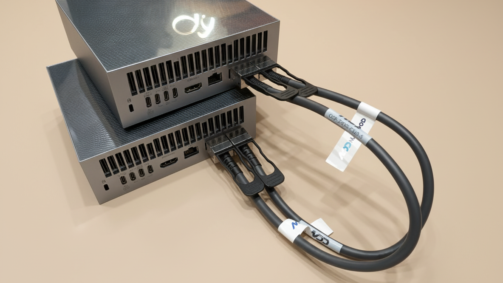


---

## NVIDIA Recommendation vs What I Used

NVIDIA's reference: one direct CX-7↔CX-7 200 GbE link, NCCL over RoCEv2, single /30, MTU≈9000.

I tried four patterns: **1, 2, and 4 dedicated interfaces** (each its own /24, MTU 9216), plus bonded variants (802.3ad/LACP and balance-xor).

Pinning/selection used `UCX_NET_DEVICES` / `NCCL_SOCKET_IFNAME`; single-HCA and multi-HCA runs used `NCCL_IB_HCA` (and `NCCL_NET_FORCE_MERGE`).

**Results match the log:**
- Single ≈ 100 Gb/s iperf3
- Dual ≈ 200 Gb/s
- NCCL all-to-all busbw ~18–19 GB/s (≈145–152 Gb/s on wire)
- ib_write_bw ~93–95 Gb/s per 200 GbE port
- Bonding did **not** aggregate RDMA/NCCL (hashing per flow; bond0 even triggered NCCL aborts)

**If we rank by throughput gain:** 4 discrete ifaces > 2 discrete ifaces > 1 iface >> LACP/XOR bonds (no RDMA scaling).

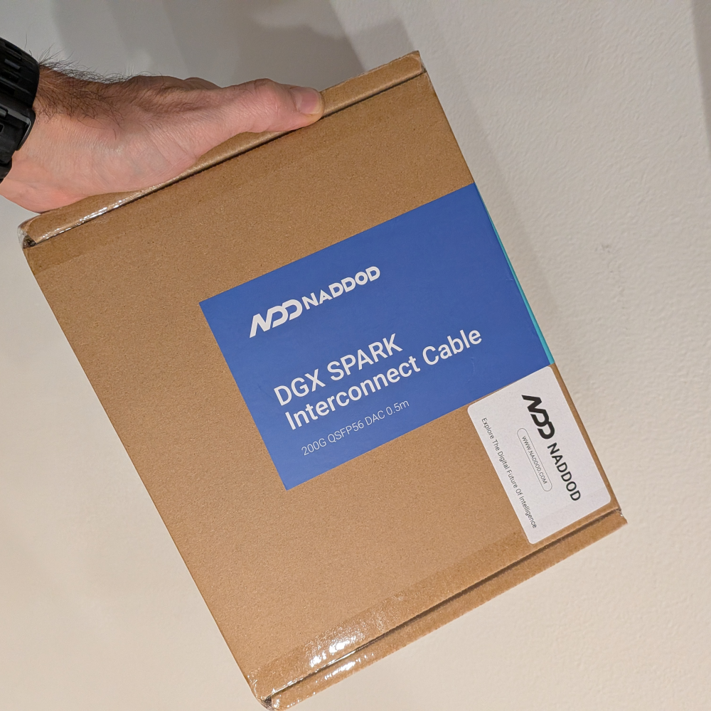

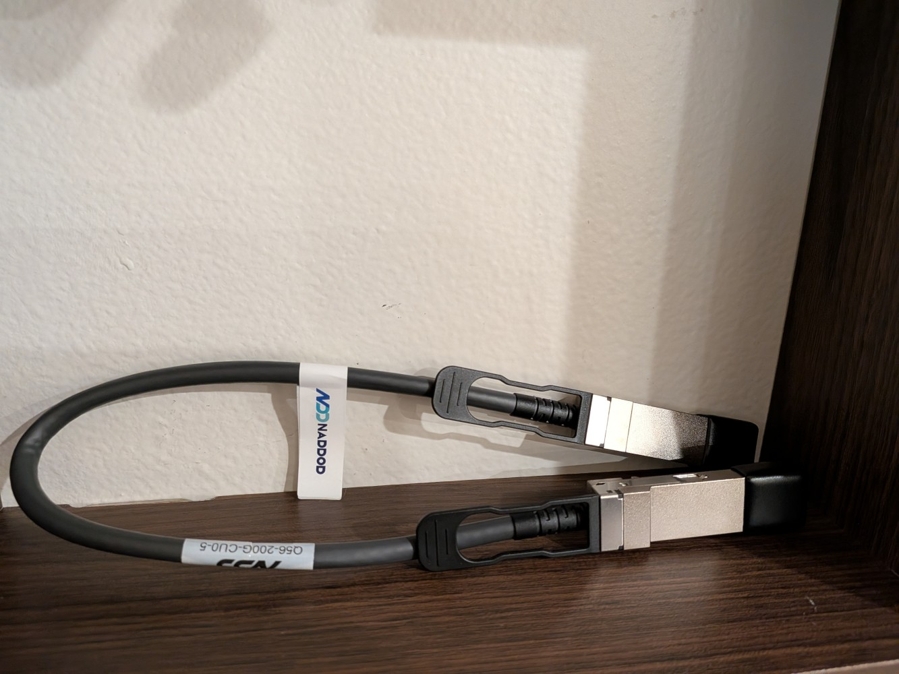

---

## Configuration

### Physical

Connect CX-7 to CX-7 with the QSFP112 DAC. Verify 200 GbE, FEC mode, and lane health.

The box has two ConnectX-7 adapters, each with 2× QSFP112, and Linux exposes four PFs: `0000:01:00.{0,1}` and `0002:01:00.{0,1}` both mapped to `enp1s0f0np0/enP2p1s0f0np0` and `enp1s0f1np1/enP2p1s0f1np1`.

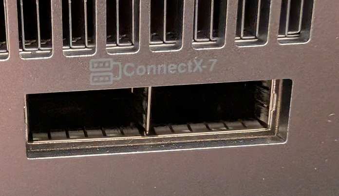

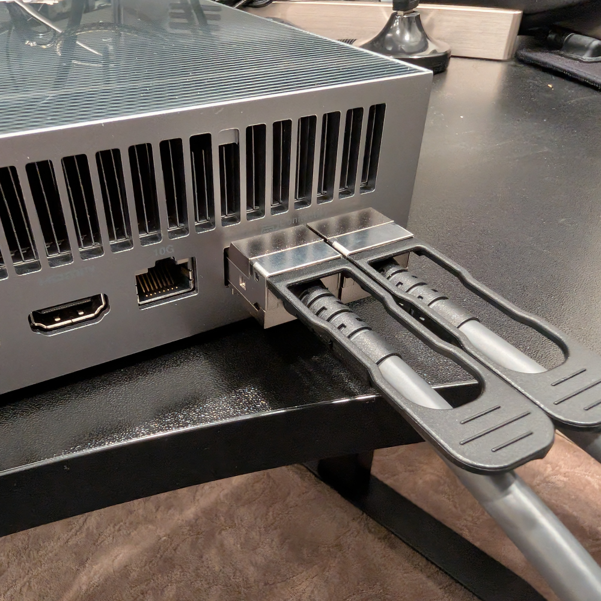

```
lspci -tvv
```

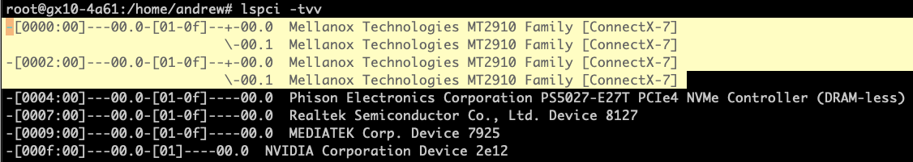

> Check: [ConnectX-7 NIC in DGX Spark](https://forums.developer.nvidia.com/t/connectx-7-nic-in-dgx-spark/350417) and [How to Configure RoCE over LAG](https://enterprise-support.nvidia.com/s/article/How-to-Configure-RoCE-over-LAG-ConnectX-4-ConnectX-5-ConnectX-6) for more info.

**This is the expected behavior due to a limitation in the GB10 chip.**

> The SoC can't provide more than x4-wide PCIe per device, so, in order to achieve the 200 Gbps speed, we had to use the CX-7's multi-host mode, aggregating 2 separate x4-wide PCIe links, which combined can deliver the 200 Gbps speed. As a consequence, the interfaces show 4 times, because each root port has to access both interface ports through a x4 link. For maximum speed, you can aggregate all ports, or for a single cable, aggregate `enp1s0f0np0` with `enP2p1s0f0np0` using balance-XOR (mode2).

XOR aggregation did not work for me. Hopefully NVIDIA will provide recommendations.

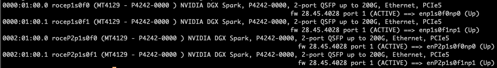

### Link + IP

Set MTU 9216 on both ends and assign a /30 over the CX-7 interfaces. The NVIDIA guide provides a netplan template if you prefer declarative config.

```bash
# Spark gx10-4a61
nmcli con add type ethernet ifname enp1s0f0np0 con-name enp1s0f0np0 \
  ipv4.addresses 10.77.0.1/24 ipv4.method manual ipv4.never-default yes \
  802-3-ethernet.mtu 9216 connection.autoconnect yes
nmcli con up enp1s0f0np0

# Spark gx10-9c8c
nmcli con add type ethernet ifname enp1s0f0np0 con-name enp1s0f0np0 \
  ipv4.addresses 10.77.0.2/24 ipv4.method manual ipv4.never-default yes \
  802-3-ethernet.mtu 9216 connection.autoconnect yes
nmcli con up enp1s0f0np0
```

### RoCEv2 Sanity

Confirm an RDMA device and GIDs for RoCE v2. Expect RDMA to work out of the box over a direct link — no switch means no PFC/ECN to tune; jumbo MTU lowers per-packet overhead.

```
root@gx10-4a61:/home/andrew# rdma link
link rocep1s0f0/1    state ACTIVE physical_state LINK_UP netdev enp1s0f0np0
link rocep1s0f1/1    state ACTIVE physical_state LINK_UP netdev enp1s0f1np1
link roceP2p1s0f0/1  state ACTIVE physical_state LINK_UP netdev enP2p1s0f0np0
link roceP2p1s0f1/1  state ACTIVE physical_state LINK_UP netdev enP2p1s0f1np1

root@gx10-4a61:/home/andrew# ibv_devices
    device                 node GUID
    ------              ----------------
    rocep1s0f0          30c59903003e4a62
    rocep1s0f1          30c59903003e4a63
    roceP2p1s0f0        30c59903003e4a66
    roceP2p1s0f1        30c59903003e4a67
```

---

## Results

### One Interface (enp1s0f0np0 ↔ enp1s0f0np0)

**TLDR:** iperf3 ≈ 100 Gbps on a single CX7 port (L3 /24, MTU 9216). ib_write_bw ≈ 11.6–11.9 GB/s (≈93–95 Gbps) per 200 GbE port. NCCL alltoall busbw ≈ 17.52 GB/s (≈140.16 Gbps on wire).

#### iperf

```bash
# Server
iperf3 -s
# Client
iperf3 -c 10.77.0.2 -P 64 -t 30
```

**98.3 Gbit/s symmetrical**

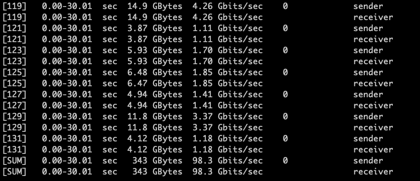

#### ib_write_bw

```bash
# Server
ib_write_bw -R -x 3 --report_gbits -D 60
# Client
ib_write_bw -R -x 3 --report_gbits -D 60 10.77.0.2
```

Observed ~11,632–11,859 MB/s ⇒ ~93.1–94.9 Gbps.

#### Collective (nccl-tests)

```bash
andrew@gx10-4a61:~/nccl-tests/build$ mpirun \
  -x UCX_NET_DEVICES=enp1s0f0np0 \
  -x NCCL_SOCKET_IFNAME=enp1s0f0np0 \
  -x OMPI_MCA_btl_tcp_if_include=enp1s0f0np0 \
  -np 2 -H 10.77.0.1:1,10.77.0.2:1 \
  -x LD_LIBRARY_PATH=$LD_LIBRARY_PATH \
  ./alltoall_perf -b 2 -e 8G -f 2
```

```
# nccl-tests version 2.17.6 nccl-headers=22803 nccl-library=22803
# Collective test starting: alltoall_perf
# nThread 1 nGpus 1 minBytes 2 maxBytes 8589934592 step: 2(factor)

  8589934592  1073741824  float  none  -1  249500  34.43  17.21  0  245143  35.04  17.52  N/A

# Avg bus bandwidth : 6.72901
# Collective test concluded: alltoall_perf
```

**17.52 × 8 = 140.16 Gbps**

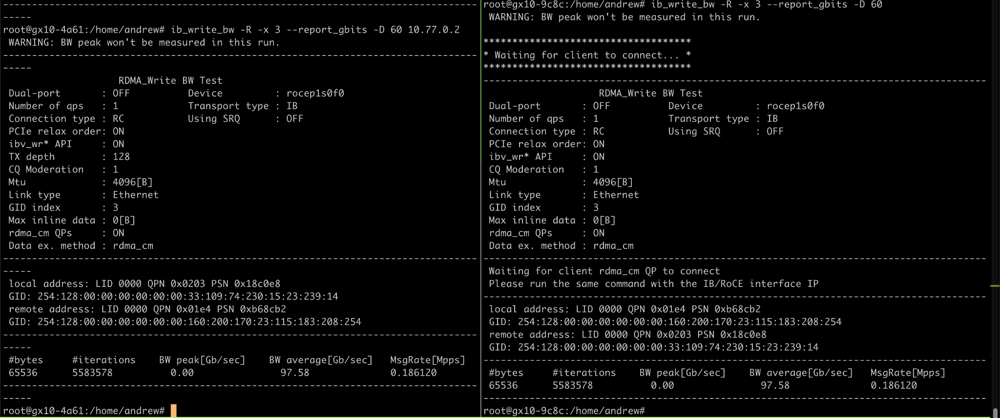

> Note: Second interface is up — if second interface (enP2p1s0f0np0) is down, ~94.40 Gbps. Traffic distributed equally.

```
mlnx_perf -i enp1s0f0np0  | grep bytes_phy
  tx_bytes_phy: 9,218,505,448 Bps  = 73,748.4 Mbps
  rx_bytes_phy: 9,217,481,142 Bps  = 73,739.84 Mbps

mlnx_perf -i enP2p1s0f0np0 | grep bytes_phy
  tx_bytes_phy: 9,053,830,316 Bps  = 72,430.64 Mbps
  rx_bytes_phy: 9,047,431,196 Bps  = 72,379.44 Mbps
```

---

### Two Interfaces

**TLDR:** iperf3 ≈ 200 Gbps (≈100 Gbps ×2). ib_write_bw ≈ 2× 90–95 Gbps (one test per iface). NCCL alltoall busbw ≈ 18.24 GB/s (≈145.92 Gbps).

#### Configuration

```bash
# Second P2 path (Node A; mirror B as .2)
nmcli con add type ethernet ifname enP2p1s0f0np0 con-name enP2p1s0f0np0 \
  ipv4.addresses 10.77.1.1/24 ipv4.method manual ipv4.never-default yes \
  802-3-ethernet.mtu 9216 connection.autoconnect yes
nmcli con up enP2p1s0f0np0
```

#### iperf

```bash
# Servers
iperf3 -s -p 5062 --bind-dev enp1s0f0np0
iperf3 -s -p 5061 --bind-dev enP2p1s0f0np0
# Clients (run both)
iperf3 -c 10.77.0.2 -t 120 -p 5062
iperf3 -c 10.77.1.2 -t 120 -p 5061
```

Each stream ≈ 98–100 Gbps; aggregate ≈ 200 Gbps.

```
[SUM]  20.00-21.00  sec  11.4 GBytes  98.3 Gbits/sec  0
[SUM]  31.00-32.00  sec  11.5 GBytes  98.4 Gbits/sec  0
```

#### ib_write_bw

Run one per interface; each ≈ 11.6–11.9 GB/s ⇒ ~93–95 Gbps.

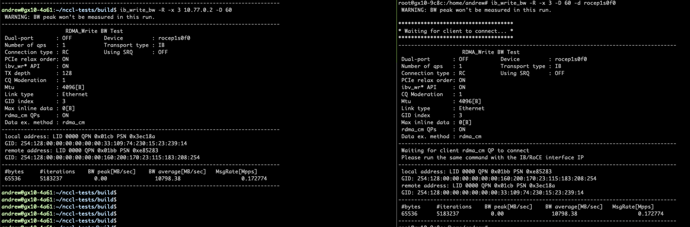

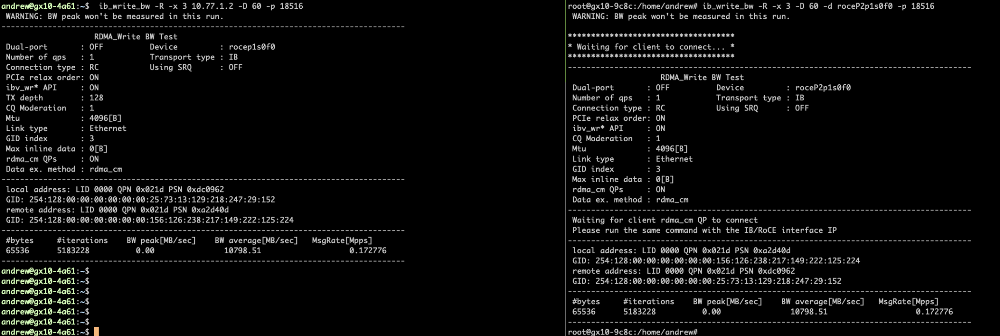

#### Collective (nccl-tests)

Peak busbw ≈ 18.24 GB/s → **145.92 Gbps**.

```bash
andrew@gx10-4a61:~/nccl-tests/build$ mpirun \
  -x UCX_NET_DEVICES=enp1s0f0np0,enP2p1s0f0np0 \
  -x NCCL_SOCKET_IFNAME=enp1s0f0np0,enP2p1s0f0np0 \
  -x OMPI_MCA_btl_tcp_if_include=enp1s0f0np0,enP2p1s0f0np0 \
  -np 2 -H 10.77.0.1:1,10.77.0.2:1 \
  -x LD_LIBRARY_PATH=$LD_LIBRARY_PATH \
  ./alltoall_perf -b 2 -e 8G -f 2
```

```
  268435456   33554432  float  none  -1   7480.63  35.88  17.94  0   7964.12  33.71  16.85  N/A
  536870912   67108864  float  none  -1  14845.6   36.16  18.08  0  14662.2   36.62  18.31  N/A
 1073741824  134217728  float  none  -1  29772.7   36.06  18.03  0  29578.0   36.30  18.15  N/A
 2147483648  268435456  float  none  -1  60001.1   35.79  17.90  0  62496.8   34.36  17.18  N/A
 4294967296  536870912  float  none  -1  118344    36.29  18.15  0  119386    35.98  17.99  N/A
 8589934592 1073741824  float  none  -1  237164    36.22  18.11  0  235450    36.48  18.24  N/A

# Avg bus bandwidth : 6.99287
```

---

### Four Interfaces

**TLDR:** iperf3 ≈ 400 Gbps (≈100 Gbps ×4). ib_write_bw ≈ 4× 90–95 Gbps (per-iface tests). NCCL alltoall busbw ≈ 18.88 GB/s (≈151.0 Gbps).

#### Configuration

```bash
# Add two more ifaces (Node A; mirror B as .2)
nmcli con add type ethernet ifname enp1s0f1np1 con-name enp1s0f1np1 \
  ipv4.addresses 10.88.0.1/24 ipv4.method manual ipv4.never-default yes \
  802-3-ethernet.mtu 9216 connection.autoconnect yes
nmcli con add type ethernet ifname enP2p1s0f1np1 con-name enP2p1s0f1np1 \
  ipv4.addresses 10.88.1.1/24 ipv4.method manual ipv4.never-default yes \
  802-3-ethernet.mtu 9216 connection.autoconnect yes
nmcli con up enp1s0f1np1
nmcli con up enP2p1s0f1np1
```

#### Collective (nccl-tests)

**24.29 × 8 ≈ 194.3 Gbps (broadcast)**

```bash
mpirun \
  -x UCX_NET_DEVICES=enp1s0f0np0,enP2p1s0f0np0,enp1s0f1np1,enP2p1s0f1np1 \
  -x NCCL_SOCKET_IFNAME=enp1s0f0np0,enP2p1s0f0np0,enp1s0f1np1,enP2p1s0f1np1 \
  -x OMPI_MCA_btl_tcp_if_include=enp1s0f0np0,enP2p1s0f0np0,enp1s0f1np1,enP2p1s0f1np1 \
  -np 2 -H 10.77.0.1:1,10.77.0.2:1 \
  -x LD_LIBRARY_PATH=$LD_LIBRARY_PATH \
  ./broadcast_perf -b 2 -e 8G -f 2
```

```
  4294967296  1073741824  float  none  0  175583  24.46  24.46  0  176853  24.29  24.29  0
```

Traffic is equally distributed across four links.

Per-interface measurements during four-interface broadcast:

```
mlnx_perf -i enp1s0f0np0  | grep bytes_phy  →  77,329.69 Mbps
mlnx_perf -i enP2p1s0f0np0 | grep bytes_phy →  76,823.79 Mbps
mlnx_perf -i enp1s0f1np1  | grep bytes_phy  →  77,021.7  Mbps
mlnx_perf -i enP2p1s0f1np1 | grep bytes_phy →  76,823.79 Mbps
```

> Note: GPU is almost 100% busy, so 200 Gbps may be a cap.

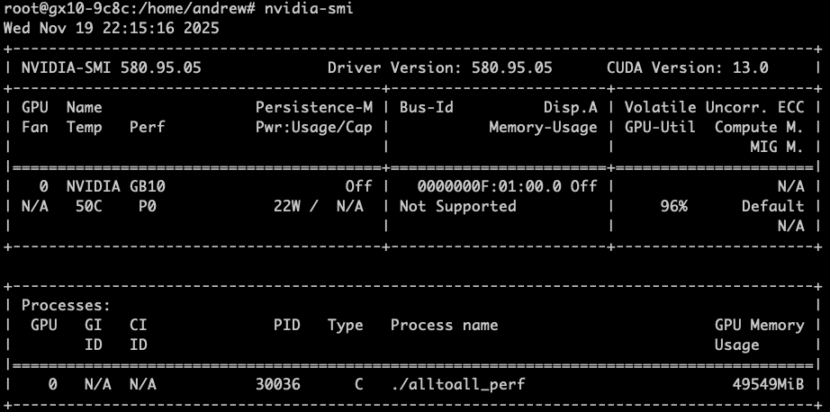

#### NCCL Topology Detail (Four Interfaces)

NCCL detects two RoCE HCAs and forms two virtual NICs by pairing ports (`rocep1s0f0+rocep1s0f1` → vNic4, `roceP2p1s0f0+roceP2p1s0f1` → vNic5), each exposed as NET/0-4 and NET/0-5 with speed=400000 (~400 Gbps).

GPU Direct RDMA disabled is expected — see [DGX Spark GB10 FAQ](https://forums.developer.nvidia.com/t/dgx-spark-gb10-faq/347344).

**Addition (21-11-2025):** Thanks for the contribution, Mai ElFouly PhD(c), Chair™, CAIQ, CRAI, CEC, CEE, PCC. Mai replicated the two-node test and confirmed both 200 GbE ports per node were actually carrying traffic evenly: per-NIC counters for `rocep1s0f0/rocep1s0f1` and `roceP2p1s0f0/roceP2p1s0f1`.

---

## Maximizing Throughput — nccl-tests with Four Interfaces

```bash
mpirun -np 2 --hostfile ~/hostfile \
  --mca btl_tcp_if_include enp1s0f0np0 \
  -x NCCL_SOCKET_IFNAME=enp1s0f0np0,enp1s0f1np1 \
  -x NCCL_IB_HCA=rocep1s0f0,rocep1s0f1,roceP2p1s0f0,roceP2p1s0f1 \
  -x NCCL_IB_GID_INDEX=3 \
  -x NCCL_IB_QPS_PER_CONNECTION=8 \
  -x NCCL_CROSS_NIC=1 \
  -x NCCL_MIN_NCHANNELS=8 \
  -x NCCL_DEBUG=INFO \
  -x LD_LIBRARY_PATH \
  ./build/all_reduce_perf -b 4G -e 4G -f 2 -g 1 -n 20
```

**26.9 GB/s ≈ 215 Gb/s** — traffic is balanced.

`all_reduce_perf` reached a best Avg bus bandwidth **26.9 GB/s (≈215 Gb/s effective)**.

Tuning QPs or enabling QBS did not improve throughput in this setup (QPS=8/4 ≈24.6 GB/s vs. no explicit QPS ≈26.9 GB/s). Takeaway: dual-port RoCE striping works out of the box; for this message size, extra QPs/QBS brought no gain, and any perceived single-link cap is likely a tooling artifact 🥺 rather than an idle port.

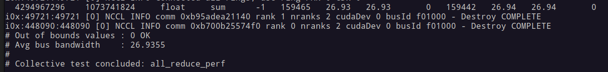

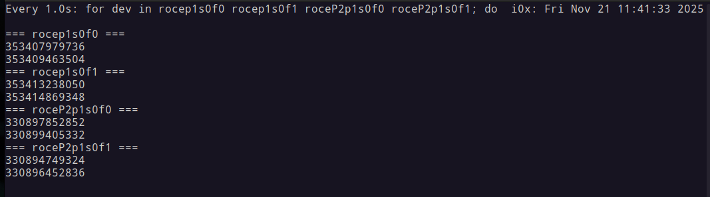

---

## Port Channel (Bonding)

**TLDR:**
- **balance-xor (layer3+4):** iperf SUM ≈ 106 Gbps; NCCL produced errors.
- **802.3ad/LACP (fast, layer3+4):** unstable for RDMA; NCCL aborted.

### Configuration

```bash
# XOR
nmcli con add type bond ifname bond0 con-name bond0 \
  bond.options "mode=balance-xor,miimon=100,xmit_hash_policy=layer3+4" \
  ipv4.addresses 10.77.0.1/24 ipv4.method manual \
  connection.autoconnect yes 802-3-ethernet.mtu 9216
nmcli con add type ethernet ifname enp1s0f0np0 master bond0 con-name bond0-slave-enp1s0f0np0
nmcli con add type ethernet ifname enP2p1s0f0np0 master bond0 con-name bond0-slave-enP2p1s0f0np0
nmcli con up bond0 && nmcli con up bond0-slave-enp1s0f0np0 && nmcli con up bond0-slave-enP2p1s0f0np0

# LACP
nmcli con add type bond ifname bond0 con-name bond0 \
  bond.options "mode=802.3ad,miimon=100,lacp_rate=fast,xmit_hash_policy=layer3+4" \
  ipv4.addresses 10.77.0.1/24 ipv4.method manual connection.autoconnect yes \
  802-3-ethernet.mtu 9216
# add same slaves; bring up slaves before bond
```

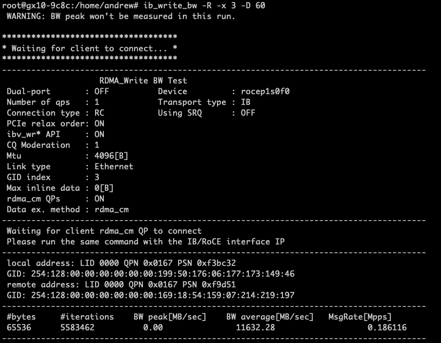

### iperf

XOR: ~106 Gbps total with many parallel TCP streams (hashing spreads flows; single flow ≤ one link).

### ib_write_bw

`ib_write_bw` to a bond IP still lands on one physical port; typical single-port results (~93–95 Gbps).

### Collective (nccl-tests)

NCCL over RoCE failed under both XOR and LACP:

```bash
mpirun \
  -x UCX_NET_DEVICES=bond0 \
  -x NCCL_SOCKET_IFNAME=bond0 \
  -x OMPI_MCA_btl_tcp_if_include=bond0 \
  -np 2 -H 10.77.0.1:1,10.77.0.2:1 \
  -x NCCL_DEBUG=INFO \
  -x NCCL_DEBUG_SUBSYS=all \
  -x LD_LIBRARY_PATH=$LD_LIBRARY_PATH \
  ./alltoall_perf -b 2 -e 8G -f 2
```

```
gx10-9c8c: Test NCCL failure alltoall.cu:274 'unhandled system error (run with NCCL_DEBUG=INFO for details) / '
```

```
[2025-11-19 18:02:33] gx10-9c8c:22890:22900 [0] transport/net_ib.cc:2470 NCCL WARN NET/IB:
Got completion from peer 10.77.0.1<35162> with status=12 opcode=129 len=65536 vendor err 129 (Recv)
localGid ::ffff:10.77.0.2 remoteGids::ffff:10.77.0.1 hca roceP2p1s0f0

gx10-9c8c:22890:22890 [0] NCCL INFO comm 0xaf6bad6d6e20 rank 1 nranks 2 cudaDev 0 busId f01000 - Abort COMPLETE
gx10-9c8c: Test NCCL failure common.cu:401 'remote process exited or there was a network error / '
```

---

## Summary

| Configuration | iperf3 | ib_write_bw | NCCL alltoall busbw |
|---|---|---|---|
| 1 interface | ~100 Gbps | ~93–95 Gbps/port | 17.52 GB/s (140 Gbps) |
| 2 interfaces | ~200 Gbps | ~93–95 Gbps/port | 18.24 GB/s (146 Gbps) |
| 4 interfaces | ~400 Gbps | ~93–95 Gbps/port | 18.88 GB/s (151 Gbps) |
| all_reduce (4 ifaces) | — | — | **26.9 GB/s (215 Gbps)** |
| Bonding (XOR) | ~106 Gbps | ~93–95 Gbps/port | ❌ NCCL errors |
| Bonding (LACP) | unstable | — | ❌ NCCL aborts |

**Takeaways:**
- Four discrete interfaces give the best NCCL collective throughput without bonding complexity.
- RDMA/NCCL does not benefit from port-channel bonding — hashing is per-flow and bond0 causes NCCL failures.
- The 200 Gbps link is well-utilized for model parallelism workloads; dual-port RoCE striping works out of the box.
- GPU compute is likely the bottleneck for large model inference, not the interconnect.
